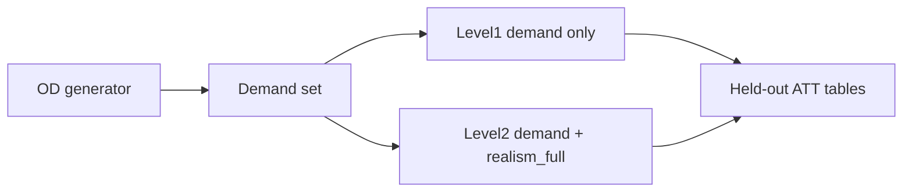
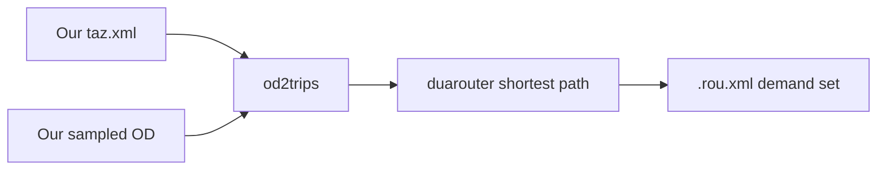

# Hub-centric OD demand realism (grid4x4, 1800 s)

## Research claim

Open RL-TSC benchmarks often score controllers on **one fixed demand file** every episode, so “learning” can mean memorizing a traffic movie. We already added **world/sensor realism** (hetero, slow-start, crossing, partial obs, `realism_full`). This work adds a **demand realism layer**: hub-structured OD, mixed fringe and within-network departures, stochastic generation, and a **demand set + held-out** protocol. The claim is that fair comparison should report **held-out ATT** under this demand (and, in a second stage, under demand + `realism_full`)—not only ATT on a single training movie.

We are **not** shipping a new RL algorithm or importing a real city’s census OD onto the grid.

---

## What we want to do

1. **Generate** many 1800 s route files for grid4x4 that look like hub-centric city demand (not the default LibSignal single movie).
2. **Train/evaluate** in LibSignal by rotating train files and scoring on held-out files.
3. **Run Level 1:** FixedTime, MaxPressure, DQN, PressLight, CoLight with that demand protocol and world axes **off**.
4. **Run Level 2:** same demand protocol with `**realism_full` on**, same five methods.

---

## TAZ (what it is)

A **TAZ** (traffic analysis zone) is a named group of road edges used as a shared origin and/or destination. An OD matrix says “send N cars from zone A to zone B in this time window.” SUMO then picks concrete edges inside those zones.

TAZ is **not** a LibSignal runtime feature and we are **not** downloading someone else’s city TAZ. We **write our own** `taz.xml` for grid4x4:

- **Fringe TAZs** — border stubs (enter/leave the study area)
- **Internal source TAZs** — edges *between* intersections (departures from within the network)
- **Hub TAZs** — center approaches with high attraction (CBD-like)

Hubs exist **because demand is hub-centric**: most trips touch a hub as origin and/or destination. That is the demand model, not an extra toggle.

---

## How the generator works

We build a **Python generator**. It owns the realism logic; SUMO only expands files.

1. Load/author **TAZ** (fringe + internal + hubs).
2. **Sample OD matrices** with a gravity-style rule (more flow to nearby/heavy hubs), shoulder+peak timeline over **1800 s**, and RNG so each file differs.
3. Call SUMO `**od2trips**` → individual trips with **random** depart times in each bin.
4. Call SUMO `**duarouter**` → **shortest paths** on existing `grid4x4.net.xml` (signals do not choose routes).
5. Write a **demand set**: `fixed_*.rou.xml`, `train_00…N.rou.xml`, `hold_00…K.rou.xml`, plus a manifest.

**Origin mix (v1):** about **60–70% fringe**, **30–40% within-network** (spawn on internal approaches—not driveways). Destinations hub-heavy.

---

## How it plugs into LibSignal

LibSignal already runs SUMO with a `.rou.xml`. We add a thin protocol: each training episode loads the next `train_*` file; every so often we evaluate on `hold_*` with no learning. Agents, rewards, and ATT stay the same. Level 2 only adds existing world YAML (`realism_full`).

TAZ/`od2trips` never run during training—only the precomputed route files do.

---

## Demand components (compact)

- Hub-centric OD (gravity + skewed hub weights)
- Fringe + within-network departures
- 1800 s shoulder+peak timeline
- Stochastic OD samples and departures (seeded, reproducible)
- Shortest-path routing
- Demand set + held-out evaluation

World axes stay for Level 2 only.

---

## Validation (before long runs)

Check hub-touch share (majority), fringe/internal mix, non-flat depart timeline, distinct train files, held-out disjoint from train, all routes valid, MP smoke finishes at 1800 s.

---

## Experiments

- **Level 1:** demand set + held-out, axes off — five methods — held-out ATT (+ train−held-out gap for RL).
- **Level 2:** same demand + `realism_full` — re-run five methods — compare to Level 1.

Same demand files within a level ⇒ methods stay comparable.

---

## Build order

TAZ → generator → demand set → LibSignal hooks/configs → validate → Level 1 → Level 2.

## Out of scope

City OD import; driveway network rebuild; turn-mix control; new RL models.