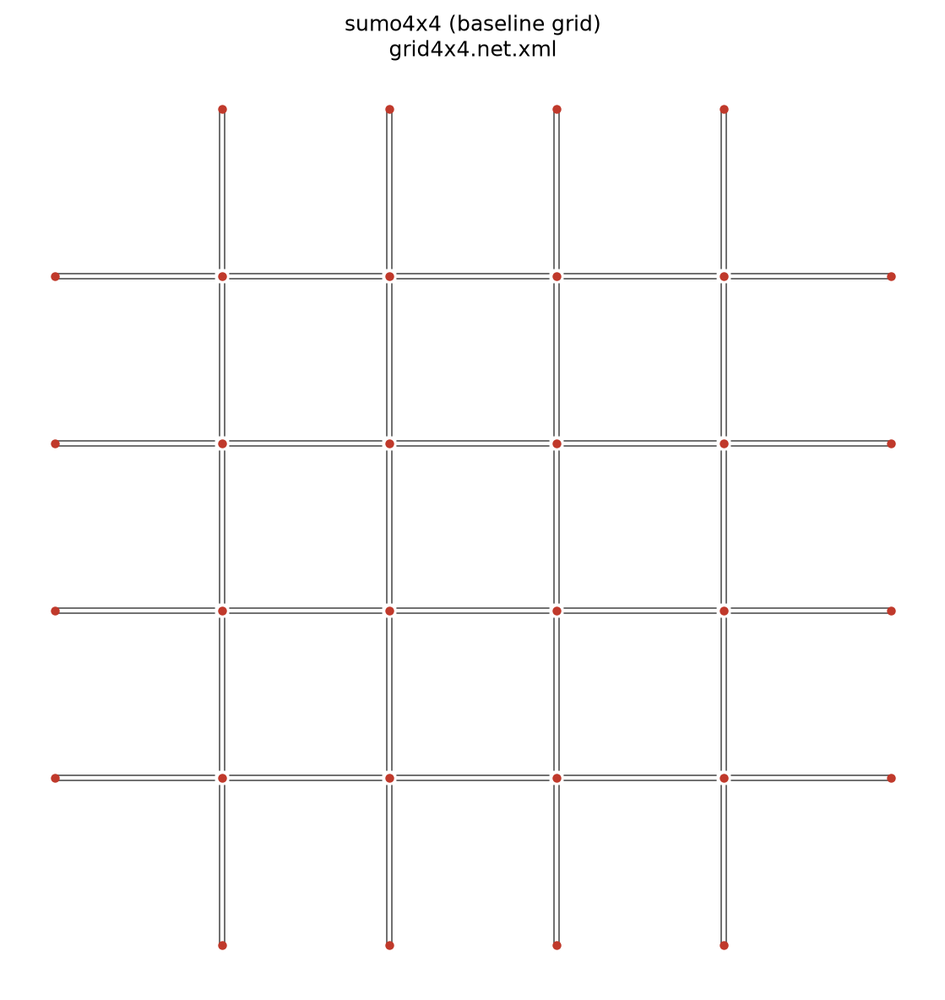
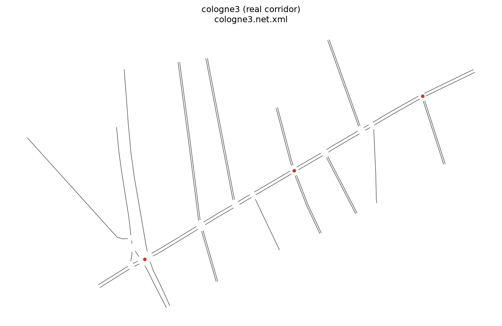
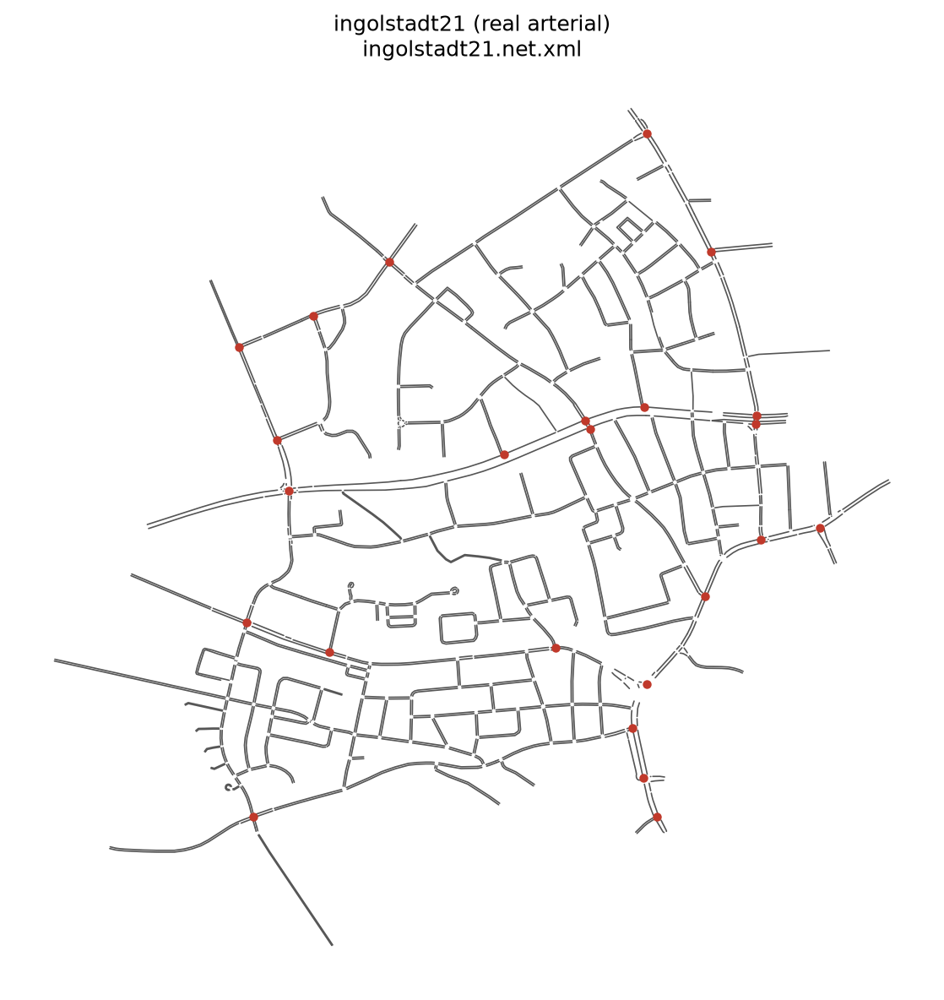
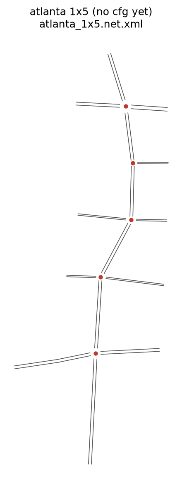
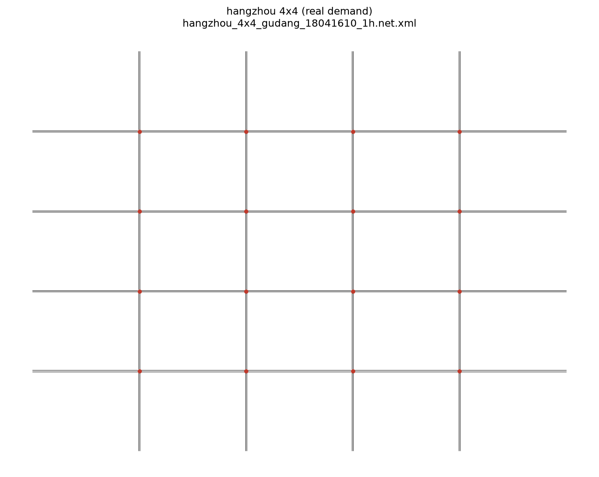
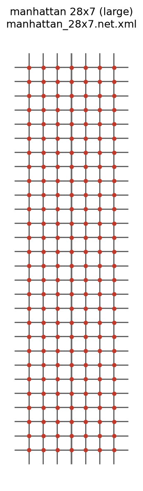

# Alternative Networks Beyond `sumo4x4`

Research note for [issue #32](https://github.com/sal0-h/libsignal/issues/32): which
bundled networks are more interesting than the synthetic `sumo4x4` grid that dominates
our experiments, and which ones are ready to run today.

Topology plots below were generated with `sumolib`. Live SUMO-GUI inspection confirmed
each candidate loads and runs with vehicles (see commands at the end).

---

## Why leave `sumo4x4`?

`sumo4x4` (`data/raw_data/grid4x4/`) is a **perfectly regular Manhattan grid**:

- 16 interior 4-way junctions + 16 fringe portal TLs = **32 agents**
- Uniform 3-lane edges, identical NEMA 8-phase plans (post PR #6)
- Synthetic demand (~1.5k vehicles / ~1 h)

It is excellent for debugging multi-agent code, but it is **not** a realistic urban
topology: no irregular geometry, no mixed phase counts, no real OD patterns. Almost all
recent runs in this fork used it (see `data/output_data/tsc/*/sumo4x4/`).



---

## Inventory (SUMO-ready vs data-only)

### Configured `--network` names (`configs/sim/sumo*.cfg`)

| `--network` | Underlying map | TLs | Topology | Demand | Status |
|---|---|---:|---|---|---|
| `sumo1x1` | cologne1 | 1 | real single junction | real Cologne | ready (smoke / unit) |
| `sumo1x3` / `sumo_cologne3` | cologne3 | 3 | real corridor | real Cologne | **ready, already used some** |
| `sumo1x21` | **ingolstadt21** | 21 | real irregular arterial | trips (RESAS) | **ready, most interesting** |
| `sumo4x4` | grid4x4 | 32 | synthetic grid | synthetic | default / overused |
| `sumo7x28` | manhattan_28x7 | 196 | large synthetic grid | NY-style | ready but heavy |
| `sumohz1x1` (+ config2–4) | Hangzhou 1×1 sites | 1 | real single junction | real Hangzhou peak | ready |
| `sumohz4x4` | Hangzhou Gudang 4×4 | 16 | regular grid + real demand | real Hangzhou | ready (grid-shaped) |
| `sumohz4x4_hetero` | Hangzhou hetero variant | 16 | same + mixed vTypes | real | ready |
| `sumo_atlanta1x5` | atlanta_1x5 | 5 | real arterial stub | Atlanta routes | **wired in this PR** |

### Present under `data/raw_data/` but **not** wired as `--network`

| Folder | TLs | Notes |
|---|---:|---|
| `arterial4x4/` | 16 | net only — **no `.rou.xml`** |
| `arterial_1x6/` | — | CityFlow JSON only |
| `manhattan_16x3/`, `manhattan_2510/`, `NewYork/`, `LA_1x4/` | — | CityFlow / JSON only |
| Hangzhou 1×1 variants without `.net.xml` | — | CityFlow `flow.json` + `roadnet.json` only |

CityFlow / OpenEngine configs exist but are **out of scope** for this SUMO-focused fork.

---

## Visual comparison (topology)

| Network | Plot | What you see in SUMO-GUI |
|---|---|---|
| `sumo4x4` |  | Perfect lattice; fringe TLs on every portal |
| `cologne3` |  | Diagonal real corridor; 3 signalized junctions; feeder side streets |
| `ingolstadt21` |  | Dense irregular city mesh; 21 TLs on arterials; 853 edges |
| `atlanta_1x5` |  | Short 5-intersection spine with cross streets |
| `sumohz4x4` |  | Looks like another 4×4 grid (interest is the **demand**, not geometry) |
| `sumo7x28` |  | Huge regular 28×7 lattice (196 TLs) |

Live GUI checks (play + vehicles): all of the above load cleanly with `sumo-gui`; no blank
views or crashes. Hangzhou 4×4 is visually almost indistinguishable from `sumo4x4`.
Ingolstadt and Cologne are the only maps that **look** qualitatively different from a grid.

---

## Ranking: what is actually more interesting?

### 1. Best next experiment — `sumo1x21` (Ingolstadt21)

- **Real German arterial** (RESAS / SUMO benchmark family), not a synthetic grid
- **21 traffic lights**, heterogeneous phase counts (4–8) and approach geometries (mostly
  3-leg + some 4-leg)
- **853 edges** — far richer topology than 80-edge grids
- Demand via **4283 trips** (not flat synthetic flows)
- Phasing style: **permissive lefts** (`g`) — a built-in realism contrast vs protected
  NEMA on `sumo4x4` (see [SIGNAL_CONTROL_THEORY.md](SIGNAL_CONTROL_THEORY.md) §8)
- Config already exists: `--network sumo1x21`
- Caveat: MPLight/FRAP `signal_config` does **not** list Ingolstadt; prefer MaxPressure /
  DQN / PressLight / CoLight-style agents that read phases from the world

```bash
python run.py --agent maxpressure --world sumo --network sumo1x21 --seed 42 --ngpu -1
```

### 2. Best small real corridor — `sumo_cologne3` / `sumo1x3`

- 3 real Cologne junctions, mixed 6/8-phase plans, ~2.9k vehicles
- Already has prior runs under `data/output_data/tsc/*/sumo_cologne3/`
- Fast enough for multi-seed RL on CPU; good “step up” from `sumo1x1` without 32 agents
- `sumo1x3` and `sumo_cologne3` point at the **same** underlying map (duplicate configs)

```bash
python run.py --agent maxpressure --world sumo --network sumo_cologne3 --seed 42 --ngpu -1
```

### 3. Best “same size, real demand” — `sumohz4x4`

- Still a 4×4 **grid** (so GUI looks familiar), but demand is real Hangzhou peak-hour
- 16 TLs only (no fringe portals) — cleaner agent count than `sumo4x4`’s 32
- Use when you want demand realism without leaving grid geometry

### 4. Newly wired arterial stub — `sumo_atlanta1x5`

- 5 TLs, heterogeneous phase plans (2 / 4 / 8) — good stress test for per-intersection
  action spaces
- Pure protected phasing; short ~15 min demand span in the route file
- Was data-complete but missing a sim `.cfg`; added as `sumo_atlanta1x5`

### 5. Scalability stress only — `sumo7x28` (Manhattan 28×7)

- 196 identical-grid TLs — interesting for **scale**, not for geometric realism
- Slow on CPU; treat as a stretch goal, not the first alternative to `sumo4x4`

### Deprioritize for “more interesting topology”

| Network | Why |
|---|---|
| `sumohz1x1` / configs | Real demand, but still **one** intersection |
| `sumo1x1` | Smoke tests only |
| `arterial4x4` | No routes — cannot run without generating demand |
| CityFlow-only folders | Not tested in this fork |

---

## Recommended experiment ladder (issue #32)

1. **Reproduce a classical baseline** on `sumo_cologne3` (MaxPressure / fixedtime) — cheap,
   real corridor, already partially exercised.
2. **Primary new map:** MaxPressure + one RL agent (e.g. DQN or PressLight) on
   **`sumo1x21`** — irregular topology + heterogeneous phases.
3. **Optional demand contrast:** same agents on `sumohz4x4` vs `sumo4x4` (geometry similar,
   demand different).
4. **Optional hetero action-space probe:** `sumo_atlanta1x5`.
5. Leave `sumo7x28` for a dedicated scalability run.

### GUI inspection commands

```bash
source .venv/bin/activate
sumo-gui -c data/raw_data/cologne3/cologne3.sumocfg
sumo-gui -c data/raw_data/ingolstadt21/ingolstadt21.sumocfg
sumo-gui -c data/raw_data/atlanta_1x5/atlanta_1x5.sumocfg
# LibSignal path (sets gui:true in cfg, needs --interface traci):
python run.py --agent fixedtime --world sumo --network sumo4x4_gui --interface traci --ngpu -1
```

LibSignal’s `gui: true` path opens `sumo-gui` on `reset()` and requires **`--interface traci`**
(libsumo cannot reopen a GUI window in-process). See `world/world_sumo.py`.

---

## Doc fixes shipped with this note

[`SUMO_NETWORKS.md`](SUMO_NETWORKS.md) previously listed **wrong raw paths** for several
configs (e.g. `sumo1x3` → arterial, `sumo1x21` → arterial, `sumo7x28` → cologne7x28). The
table now matches the actual `.cfg` files (`cologne3`, `ingolstadt21`, `manhattan_28x7`).
