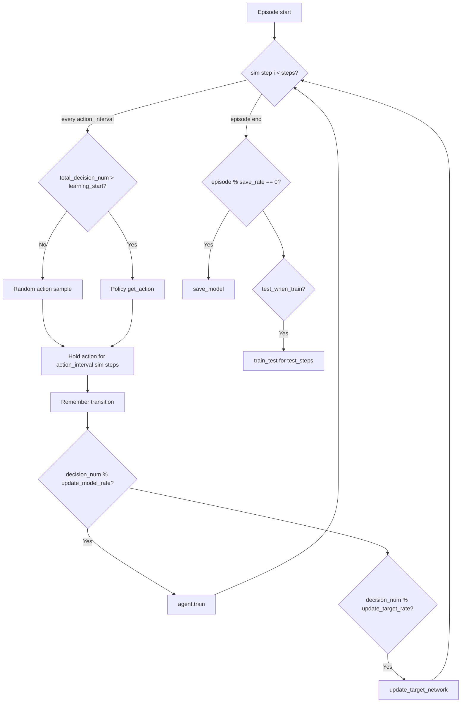

# TSC Config Parameter Report

This report documents every parameter in `configs/tsc/*.yml`, traced through `run.py`, `utils/logger.py`, `common/interface.py`, trainers, worlds, and agents. Where a parameter is **not read by Python**, that is stated explicitly.

---

## How TSC configs are loaded

```
CLI args (run.py)
    +
configs/tsc/<agent>.yml  ──includes──► configs/tsc/base.yml
    │
    ▼
build_config() in utils/logger.py
    │
    ├── config['command']  ← CLI args (Registry command_mapping['setting'])
    ├── config['task']     ← YAML metadata (not registered; see task section)
    ├── config['world']    ← merged into configs/sim/<network>.cfg
    ├── config['trainer']  → Registry trainer_mapping['setting']
    ├── config['model']    → Registry model_mapping['setting']
    └── config['logger']   → Registry logger_mapping['setting']
```

- **File selection:** `--task tsc --agent dqn` loads `configs/tsc/dqn.yml`, which includes `base.yml`.
- **Merge rule:** included files are merged first; the child file wins on conflicts.
- **`includes`:** loader-only; not present in the final config dict.
- **Output path:** `<world.dir>/output_data/<task>/<world>_<agent>/<network>/<prefix>` (from `get_output_file_path`; `world.dir` defaults to `data/`, and `os.path.join` adds no trailing slash).

---

## Section: `task` (metadata only)

| Parameter | Default (`base.yml`) | What the code does |
|-----------|---------------------|-------------------|
| `task.description` | string | **Not read** anywhere in Python. |
| `task.task_name` | `tsc` | **Not read.** Task dispatch uses CLI `--task`, not this field. |

---

## Section: `world`

These keys live in TSC YAML but are applied to the **simulator config** (`configs/sim/<network>.cfg`) by `modify_config_file()` in `utils/logger.py`. Any key that exists in both the sim `.cfg` and `config['world']` **with a non-`None` value** gets overwritten (there is a `param.get(k) is not None` guard). Keys not in the sim file are kept as `other_world_settings` and merged into `world_mapping['setting'].param`.

| Parameter | Default | What the code does |
|-----------|---------|-------------------|
| `interval` | `1.0` | Simulation step length (seconds). Read by `World` as `self.interval` in `world_cityflow.py` and `world_sumo.py`. Also forced into SUMO cfg in `modify_config_file`. |
| `seed` | `0` | Written into sim `.cfg` if that file has a `seed` key. **Not used for PyTorch/numpy seeding** — that comes from CLI `--seed` in `base_trainer.load_seed_from_config()`. |
| `dir` | `data/` | Root data directory. Used in sim paths (`roadnetFile`, `flowFile`) and output path construction. |
| `saveReplay` | `True` | Read in `base_trainer.py` as `self.save_replay`. When `True` and world is CityFlow, creates replay log dirs and enables replay saving every `save_rate` episodes in `tsc_trainer.train()`. |
| `report_log_mode` | `normal` | Only applied for **OpenEngine** sim configs (`modify_config_file` openengine branch). **Not used** for CityFlow/SUMO in Python. |
| `report_log_rate` | `10` | Present in YAML and some OpenEngine `.cfg` files. **Not read** by any Python code in this repo. |
| `no_warning` | `True` | Passed to SUMO as `--no-warnings` when merged into sim JSON (`world_sumo.py`). |
| `gui` | `False` | When `True`, SUMO runs with `sumo-gui` instead of headless `sumo` (`world_sumo.py`). |
| `rlTrafficLight` | `True` | Written into CityFlow sim JSON if the key exists. Consumed by the **CityFlow engine** natively when it reads the config file — not referenced in Python world code. |
| `physics_mode` | `standard` | Read in `world_sumo.py`. `standard` = normal SUMO physics. `ghost` = adds `--collision.action none --time-to-teleport -1`, uses ghost speed mode (vehicles ignore car-following but obey signals). Requires `--interface libsumo`. Used by `*_ncollision.yml` configs. |
| `signal_config` | *(only in `frap.yml`, `mplight.yml`)* | Nested per-network map (`grid4x4`, `hz1x1`, etc.). Read from `world_mapping['setting'].param['signal_config'][map_name]` in `frap.py` and `mplight.py`. See sub-keys below. |

### `world.signal_config` sub-keys (FRAP / MPLight only)

Looked up by `map_name = world_mapping['setting'].param['network']` (from sim `.cfg`, e.g. `"hz1x1"`).

| Sub-key | Meaning in code |
|---------|----------------|
| `phase_pairs` | List of `[lane_idx_a, lane_idx_b]` pairs defining each signal phase. Used to build the FRAP competition graph and action space. |
| `valid_acts` | Per-intersection map restricting which phase indices are valid. `null` = all phases. Used in `frap.py` to filter `phase_pairs`. |
| `lane_order` | Per-intersection remap from observation lane index → canonical order. Used when padding/reordering lane-count observations (FRAP) or setting `ob_order` (MPLight). |

---

## Section: `trainer`

Read from `Registry.mapping['trainer_mapping']['setting']` in `tsc_trainer.py` (and some agents).

| Parameter | Default | What the code does |
|-----------|---------|-------------------|
| `thread` | `4` | **Not read from YAML.** CityFlow threading uses CLI `--thread_num` (passed to `World(..., thread_num=...)`). |
| `ngpu` | `-1` | **Not read from YAML.** GPU selection uses CLI `--ngpu` → `CUDA_VISIBLE_DEVICES` in `run.py`. Trainer always gets default `gpu=0` from `TSCTrainer.__init__` signature; device is `cuda:0` if visible. |
| `learning_start` | `5000` | Number of **decision steps** (not sim steps) before the agent uses its policy. Before that, `ag.sample()` (random actions) is used. Training also only starts after this threshold (`total_decision_num > learning_start`). `-1` means effective from step 1 (used in `mplight.yml`, `ppo_pfrl.yml`). |
| `buffer_size` | `5000` | Max replay buffer length per agent (`deque(maxlen=...)` or PFRL `ReplayBuffer`). Also used as flush counter threshold in training loop. `0` for non-RL baselines disables meaningful buffering. |
| `steps` | `3600` | Max simulation steps per training episode. Training loop: `while i < self.steps`. |
| `test_steps` | `3600` | Max steps in `train_test()` and `test()`. |
| `yellow_length` | `5` | Assigned to `self.yellow_time` in `tsc_trainer.py` but **never used afterward**. Actual yellow timing: in **SUMO** from the TLS program (`yellow_phase_time = min(phase durations)` in `world_sumo.py`); in **CityFlow** it is **hardcoded to `5`** (`world_cityflow.py`). The `yellow_length` key in the sim `.cfg` is not otherwise consumed. |
| `action_interval` | `10` | Agent decides every N sim steps. Between decisions, the same action is held for N `env.step()` calls; rewards are averaged over the interval. |
| `episodes` | `200` | Training episode count (`for e in range(self.episodes)`). |
| `update_model_rate` | `1` | Train every N decision steps after `learning_start` (when `total_decision_num % rate == rate - 1`). |
| `update_target_rate` | `10` | Hard-copy target network every N decision steps after `learning_start`. |
| `test_when_train` | `True` | If `True`, runs `train_test()` after each training episode (greedy eval, logs travel time). |

---

## Section: `model`

Read from `Registry.mapping['model_mapping']['setting']`. `model.name` must match a `@Registry.register_model('...')` name.

### Core flags (all agents)

| Parameter | Default | What the code does |
|-----------|---------|-------------------|
| `name` | `"non-rl"` | Selects agent class in `tsc_trainer.create_agents()`: `Registry.mapping['model_mapping'][model_name]`. |
| `train_model` | `False` | Read by `TSCTask.run()` — if `True`, calls `trainer.train()`. |
| `test_model` | `True` | Read by `TSCTask.run()` — if `True`, calls `trainer.test()`. |
| `load_model` | `False` | **Not read anywhere.** `test()` always calls `load_model` only when `drop_load=False`; default `drop_load=True` skips loading. |
| `graphic` | `False` | If `True`, `run.py` builds a roadnet graph via `Graph_World_Interface` (required for CoLight). |
| `vehicle_max` | `1` | **CoLight only** divides lane-count observations (`ob / vehicle_max`, `colight.py`). DQN, SAC, PPO, MAGD, MADDPG, MADDPG v2 read it into an attribute but **never use** it; PressLight, FRAP, MPLight **don't read** it at all. |
| `learning_rate` | `0.001` | Optimizer LR for RL agents (RMSprop/Adam). **Exception:** `ppo_pfrl.py` reads it into `self.learning_rate` but the optimizer uses hardcoded `lr=2.5e-4`. |
| `batch_size` | `64` | Minibatch size for replay-based training. |
| `gamma` | `0.95` | Discount factor in Bellman targets. |
| `epsilon` | `0.5` | Initial ε for ε-greedy exploration. |
| `epsilon_decay` | `0.99` | Multiplied into ε after each training step (while ε > ε_min). |
| `epsilon_min` | `0.05` | Floor for ε. |
| `grad_clip` | `5.0` | Max gradient norm via `clip_grad_norm_`. |
| `one_hot` | `False` | If `phase` is also `True`, current phase is one-hot encoded in the observation. |
| `phase` | `False` | If `True`, concatenates the current signal phase (scalar, or one-hot when `one_hot: True`) with lane-count observations — done in `get_action()` / `_batchwise()`, **not** in `get_ob()`. DQN/PressLight **append** the phase; FRAP/MPLight **prepend** it. |

### Classical baseline parameters

| Parameter | Agent | What the code does |
|-----------|-------|-------------------|
| `t_min` | `maxpressure` | Minimum seconds a phase must run before switching (`maxpressure.py`: `if current_phase_time < t_min: keep phase`). |
| `mp_variant` | `maxpressure` | `varaiya` (default) = queue-based Original-MP alignment; `libsignal` = legacy `lane_count` in−out heuristic. See `docs/MAXPRESSURE.md`. |
| `sat_flow` | `maxpressure` | Uniform saturation-flow multiplier applied to each movement weight (default `1.0`). |
| `t_fixed` | `fixedtime` | Fixed green duration before cycling to next phase (`fixedtime.py`). |
| `min_green_vehicle` | `sotl` | SOTL switches phase when `(green-queue ≤ min_green_vehicle AND red-queue > max_red_vehicle)` **OR** `(green-queue == 0 AND red-queue > 0)` (`sotl.py` `get_action`). |
| `max_red_vehicle` | `sotl` | SOTL red-side threshold (see `sotl.py` `get_action`). |
| `t_min` | `sotl` | Minimum phase duration before SOTL logic can switch. |

### PressLight

| Parameter | What the code does |
|-----------|-------------------|
| `d_dense` | Hidden layer width in PressLight MLP (`presslight.py`: `nn.Linear(..., d_dense)`). |

### FRAP / MPLight (shared FRAP network)

| Parameter | In YAML | Actually used? |
|-----------|---------|----------------|
| `demand_shape` | `frap.yml`, `mplight.yml` | **Yes** — input dim per movement in FRAP network. |
| `n_layers` | both | **No** — not referenced in `frap.py` / `mplight.py`. |
| `rotation` | both | **No** — rotation is always hardcoded in the network. |
| `conflict_matrix` | both | **No** — competition mask is computed in `relation()` from `phase_pairs`. |
| `merge` | both | **No** — merge is always multiply (`rotated_phases * relations`). |
| `d_dense` | both | **No** in FRAP/MPLight (only used in PressLight). |

### MPLight-specific

| Parameter | What the code does |
|-----------|-------------------|
| `eps_start` | Initial ε for `SharedEpsGreedy` explorer. |
| `eps_end` | Final ε for linear decay. |
| `eps_decay` | **Dead YAML key — not read by `mplight.py`.** The ε-decay step count is computed independently from *trainer* params as `sub_agents * (trainer.episodes * 0.8) * trainer.steps / trainer.action_interval`. |
| `target_update` | PFRL DQN `target_update_interval = target_update * sub_agents`. |

### CoLight graph-attention

| Parameter | What the code does |
|-----------|-------------------|
| `NEIGHBOR_NUM` | **Not used** in current `colight.py` (only in commented legacy code). Graph neighbors come from roadnet via `build_index_intersection_map_*`. |
| `NEIGHBOR_EDGE_NUM` | **Not used.** |
| `N_LAYERS` | Number of `MultiHeadAttModel` blocks stacked. |
| `INPUT_DIM` | Per-layer input dim list for attention blocks. |
| `OUTPUT_DIM` | Per-layer output dim list. |
| `NODE_EMB_DIM` | MLP layer sizes for initial node embedding. |
| `NUM_HEADS` | Attention heads per layer. |
| `NODE_LAYER_DIMS_EACH_HEAD` | Per-head value dim (`dv`) per layer. |
| `OUTPUT_LAYERS` | Optional extra MLP before Q-head; empty list = direct linear to `action_space.n`. |

### MAGD / MADDPG

| Parameter | Agent | What the code does |
|-----------|-------|-------------------|
| `local_q_learn` | `magd`, `maddpg` | If `False`, critic sees joint obs+actions of all agents; if `True`, per-agent critic (`magd.py`). |
| `tau` | `magd`, `maddpg`, `maddpg_v2` | Polyak averaging rate for target network soft update. |
| `alpha` | `maddpg_v2` | Actor (policy) learning rate. |
| `beta` | `maddpg_v2` | Critic learning rate. |
| `fc1`, `fc2` | `maddpg_v2` | Hidden layer sizes for actor/critic MLPs. |

### PPO (legacy `ppo.py`)

| Parameter | What the code does |
|-----------|-------------------|
| `update_interval` | Must equal `buffer_size`; triggers `AC_train()` when env buffer fills. **Agent uses broken registry keys** (`model_setting`, `traffic_setting`) — likely non-functional with current wiring. |

---

## Section: `logger`

Read from `Registry.mapping['logger_mapping']['setting']`.

| Parameter | Default | What the code does |
|-----------|---------|-------------------|
| `root_dir` | `data/output_data/` | **Not read.** Output root comes from `world.dir` + `output_data` in `get_output_file_path`. |
| `log_dir` | `logger/` | Subdir for log files under the run output path. Used in `setup_logging` and `writeLog` DTL file. |
| `replay_dir` | `replay/` | Subdir for CityFlow replay logs; paths injected into sim cfg by `modify_config_file`. |
| `model_dir` | `model/` | **Not read.** Agents hardcode `'model'` subdir in `save_model`/`load_model`. |
| `data_dir` | `dataset/` | Subdir for on-the-fly LMDB dataset (`tsc_trainer` dataset init). |
| `save_model` | `True` | **Not checked.** Models save whenever `e % save_rate == 0`. |
| `save_rate` | `5` | Checkpoint every N training episodes; also controls CityFlow replay saving frequency. |
| `attention` | `False` | CoLight only: if `True`, `get_action` attempts to return attention weights (partially implemented). |

### Logger keys in some agent YAMLs that do nothing

Several files (`fixedtime.yml`, `maddpg.yml`, etc.) duplicate these under `logger:`:

- `train_model`, `test_model`, `load_model` → **ignored**; `TSCTask` reads `model.train_model` / `model.test_model` only.
- `get_attention`, `ave_model`, `save_dir` → **not registered** or read.

---

## Section: `traffic` (legacy — not wired)

Present in `maddpg.yml`, `maddpg_v2.yml`, `ppo.yml`, `ppo_pfrl.yml`, `dqn_backup.yml`.

**Never registered** into `Registry` by `interface.py`. Agents `maddpg.py` and `ppo.py` expect `world_mapping['traffic_setting']` and `model_mapping['model_setting']`, which are never created — those agents would crash on init with the current wiring.

All `traffic.*` keys (`one_hot`, `phase`, `ACTION_PATTERN`, `MIN_ACTION_TIME`, `YELLOW_TIME`, etc.) are **dead config** in the current codebase.

---

## CLI parameters (merged as `config['command']`)

These override or supplement YAML at runtime:

| CLI flag | Default | What the code does |
|----------|---------|-------------------|
| `--task` / `-t` | `tsc` | Selects `configs/tsc/` and `TSCTrainer` / `TSCTask`. |
| `--agent` / `-a` | `dqn` | Selects `configs/tsc/<agent>.yml`. |
| `--world` / `-w` | `cityflow` | `cityflow` or `sumo` world class. |
| `--network` / `-n` | `cityflow1x1` | Selects `configs/sim/<network>.cfg`. |
| `--prefix` | `test` | Run name in output path. |
| `--seed` | `None` | If set, seeds `random`, `numpy`, `torch` in `base_trainer`. |
| `--ngpu` | `-1` | Sets `CUDA_VISIBLE_DEVICES`. |
| `--thread_num` | `4` | CityFlow engine thread count. |
| `--interface` | `libsumo` | SUMO backend: `libsumo` (fast) or `traci`. |
| `--delay_type` | `apx` | `apx` = lane delay in metrics; `real` = world-level delay instead. |
| `--dataset` | `onfly` | Dataset handler (`onfly_dataset.py`); replay-to-disk is mostly commented out. |
| `--debug` | `False` | Pass the flag to enable DEBUG logging; otherwise use INFO. |

---

## Per-agent config files (what each overrides beyond `base.yml`)

| File | Notable overrides |
|------|-------------------|
| `dqn.yml` | `train_model: True`, tighter ε, `one_hot/phase: True`, `learning_start: 1000` |
| `colight.yml` | `graphic: True`, CoLight arch dims, `phase: False` |
| `maxpressure.yml` | `t_min: 10`, `mp_variant: varaiya`, `sat_flow: 1.0`, zeroes RL trainer params |
| `maxpressure_libsignal.yml` | Sets `mp_variant: libsignal` (legacy lane_count heuristic) |
| `fixedtime.yml` | `episodes: 1`, `t_fixed: 30`, RL params zeroed |
| `sotl.yml` | `episodes: 1`, SOTL thresholds |
| `frap.yml` | `signal_config` block, `demand_shape`, FRAP training |
| `mplight.yml` | `episodes: 500`, `learning_start: -1`, PFRL ε schedule, `signal_config` |
| `presslight.yml` | `d_dense: 20`, pressure-based reward |
| `magd.yml` | `episodes: 2000`, slower target updates, `local_q_learn: False` |
| `maddpg_v2.yml` | Full trainer override, actor-critic dims |
| `*_ncollision.yml` | Adds `world.physics_mode: ghost` (maxpressure_ncollision only that; fixedtime_ncollision also redundantly re-declares `world.gui: False`) |
| `dqn_backup.yml` | Legacy layout with `traffic:` block (unused) |

---

## Training loop semantics (how trainer params interact)



---

## Summary: commonly misunderstood parameters

| Parameter | Reality in code |
|-----------|----------------|
| `trainer.yellow_length` | Stored but unused; yellow timing from roadnet. |
| `trainer.thread` / `trainer.ngpu` | YAML ignored; use CLI flags. |
| `world.seed` | Goes to sim cfg only; PyTorch seed = CLI `--seed`. |
| `model.load_model` | Never checked; test doesn't load by default. |
| `logger.train_model` | Ignored; use `model.train_model`. |
| `vehicle_max` | Only CoLight normalizes obs with it. |
| `traffic.*` | Entire section dead in current wiring. |
| FRAP `n_layers`, `rotation`, etc. | In YAML but not read by FRAP class. |
| CoLight `NEIGHBOR_NUM` | Not used; graph from roadnet. |

---

## Related files

| Path | Role |
|------|------|
| `configs/tsc/base.yml` | Shared defaults for all TSC runs |
| `configs/tsc/<agent>.yml` | Per-agent overrides |
| `configs/sim/<network>.cfg` | Network/simulator config (merged with `world:` block) |
| `run.py` | CLI entry point and config registration |
| `utils/logger.py` | YAML loading, sim cfg modification, output paths |
| `common/interface.py` | Registry registration of config sections |
| `trainer/tsc_trainer.py` | Training loop consuming trainer/logger params |
| `task/task.py` | `train_model` / `test_model` dispatch |
